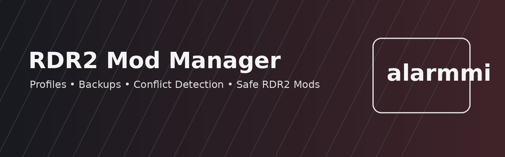

# RDR2 Mod Manager — Red Dead Redemption 2 Mod Manager for PC

**RDR2 Mod Manager** is an open-source mod manager concept for **Red Dead Redemption 2 on PC**. It is designed to help players install, enable, disable, organize, backup, and troubleshoot single-player RDR2 mods without losing track of game files.

> Unofficial project. Not affiliated with, endorsed by, or sponsored by Rockstar Games, Take-Two Interactive, Nexus Mods, Lenny's Mod Loader, Script Hook RDR2, or any mod author. Use mods responsibly and always keep backups.



<div align="center">

| 🚀 Download RDR2 Mod Manager |
|---|
| [](https://alarmmi.github.io/RDR2-Mod-Manager/) |

</div>

## Why this RDR2 Mod Manager exists

Managing Red Dead Redemption 2 mods can become messy fast: LML folders, ASI plugins, ScriptHook files, texture packs, reshades, configuration files, and manual backups all end up in the same game directory. **RDR2 Mod Manager** focuses on safe mod workflows:

- one-click enable and disable for Red Dead Redemption 2 mods;
- profile-based mod loadouts for story mode, realism, graphics, roleplay, and testing;
- automatic backups before changing the RDR2 game directory;
- conflict detection for duplicate files and risky overrides;
- readable mod manifests for advanced users;
- troubleshooting pages for common RDR2 mod problems.

## Key features

| Feature | What it does | SEO intent covered |
|---|---|---|
| Mod profiles | Save different Red Dead Redemption 2 mod setups | RDR2 mod loadout, RDR2 mod profile |
| Backup system | Restore changed files after bad installs | RDR2 mod backup, restore RDR2 files |
| Conflict scanner | Find duplicate files before launch | RDR2 mod conflict, mod manager conflict detection |
| LML-friendly layout | Keep LML mods organized | Lenny's Mod Loader manager, RDR2 LML mods |
| ASI plugin awareness | Track ASI files and ScriptHook-based plugins | RDR2 ASI loader, Script Hook RDR2 mods |
| Clean uninstall | Disable mods without deleting originals | uninstall RDR2 mods safely |

## Documentation

Start here:

- [Installation guide](docs/installation.md)
- [Quick start](docs/quick-start.md)
- [Features](docs/features.md)
- [User guide](docs/user-guide.md)
- [Compatibility](docs/compatibility.md)
- [Supported mods](docs/supported-mods.md)
- [Troubleshooting](docs/troubleshooting.md)
- [Backup and restore](docs/backup.md)
- [Configuration](docs/configuration.md)
- [FAQ](docs/faq.md)
- [Performance](docs/performance.md)
- [Architecture](docs/architecture.md)
- [Roadmap](docs/roadmap.md)
- [Glossary](docs/glossary.md)

## Example CLI usage

```bash
rdr2mm scan --game "C:\Program Files\Rockstar Games\Red Dead Redemption 2"
rdr2mm backup create --name before-graphics-pack
rdr2mm profile create realism
rdr2mm mod enable lml-realistic-economy --profile realism
rdr2mm mod disable reshade-preset --profile vanilla-safe
```

## Example mod manifest

```json
{
  "id": "example-lml-mod",
  "name": "Example RDR2 LML Mod",
  "version": "1.0.0",
  "type": "lml",
  "game": "red-dead-redemption-2",
  "files": ["lml/example-mod/install.xml", "lml/example-mod/stream/texture.ytd"],
  "requires": ["lml"],
  "conflictsWith": ["example-overhaul-pack"]
}
```


## Project status

This repository is a high-quality starter template and architecture sample. It includes docs, examples, configuration, TypeScript skeleton code, tests, issue templates, and GitHub Actions. The UI and installer can be implemented incrementally.

## Safety and fair use

RDR2 Mod Manager does not bypass DRM, does not modify online services, and is not intended for cheating or multiplayer advantage. It is designed for legitimate single-player mod organization, backups, and troubleshooting.

## Contributing

Contributions are welcome. See [CONTRIBUTING.md](CONTRIBUTING.md), [SECURITY.md](SECURITY.md), and [CODE_OF_CONDUCT.md](CODE_OF_CONDUCT.md).

## License

MIT License © alarmmi. See [LICENSE](LICENSE).
