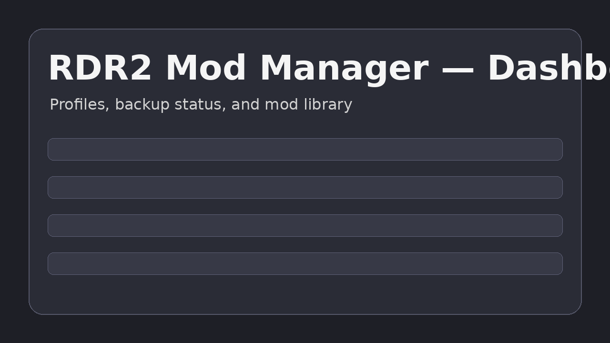
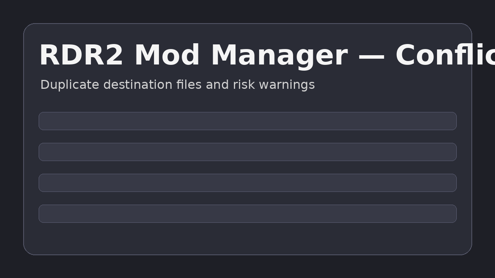
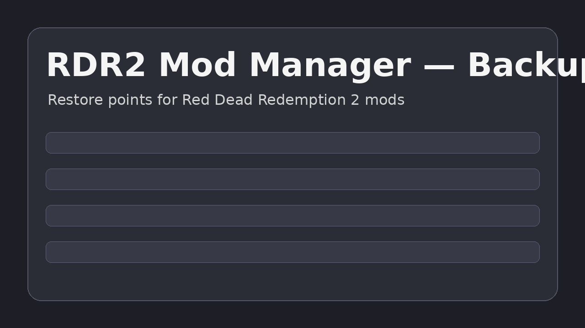

# RDR2 Mod Manager Screenshots

This page collects screenshots and visual previews for **RDR2 Mod Manager**.

## Dashboard preview

## Conflict scanner preview

## Backup manager preview

## Screenshot SEO checklist

When adding real screenshots:

- use descriptive filenames like `rdr2-mod-manager-conflict-scanner.png`;
- write useful alt text;
- compress images before committing;
- show the actual feature being documented;
- avoid copyrighted game screenshots unless you have the right to use them.

## Related RDR2 Mod Manager guides

- [Installation](installation.md)
- [Quick start](quick-start.md)
- [User guide](user-guide.md)
- [Troubleshooting](troubleshooting.md)
- [Backup and restore](backup.md)
- [FAQ](faq.md)
